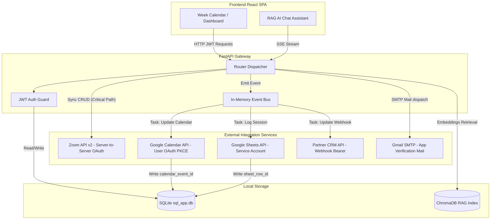
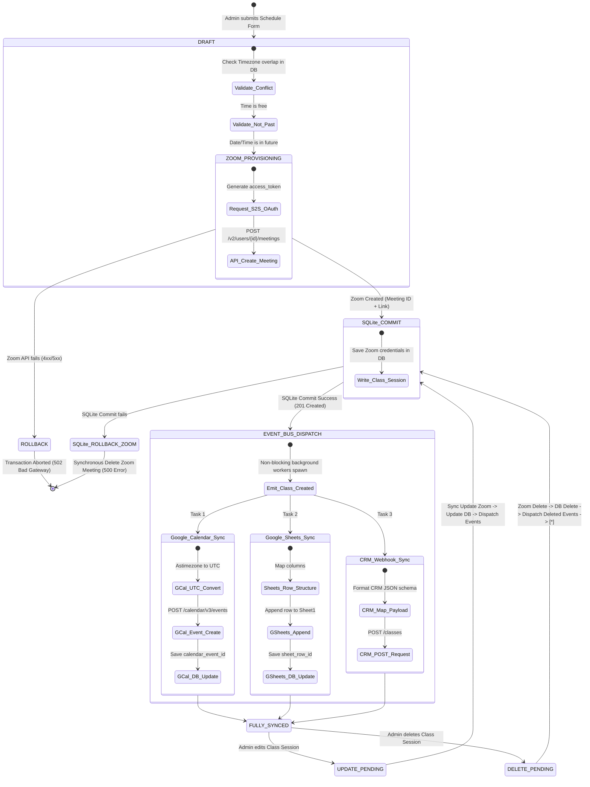
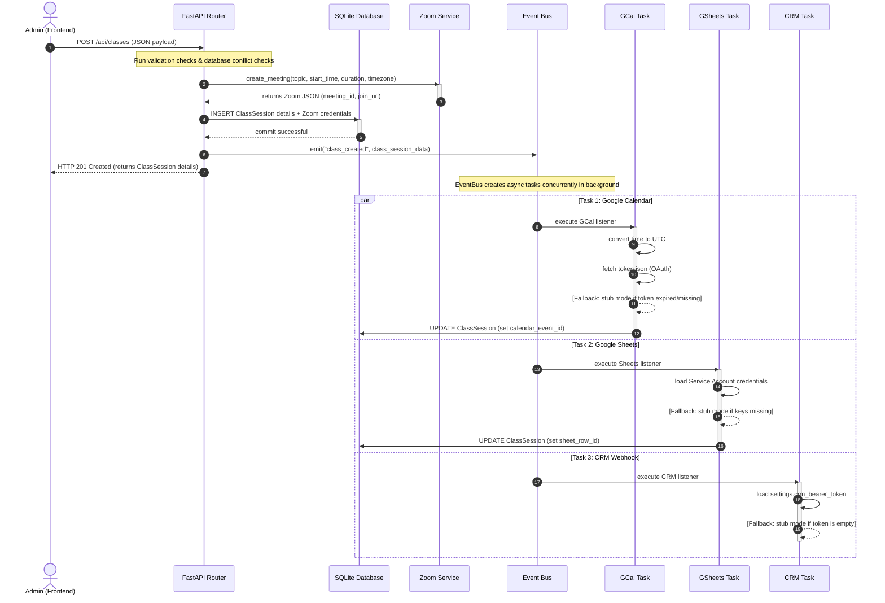
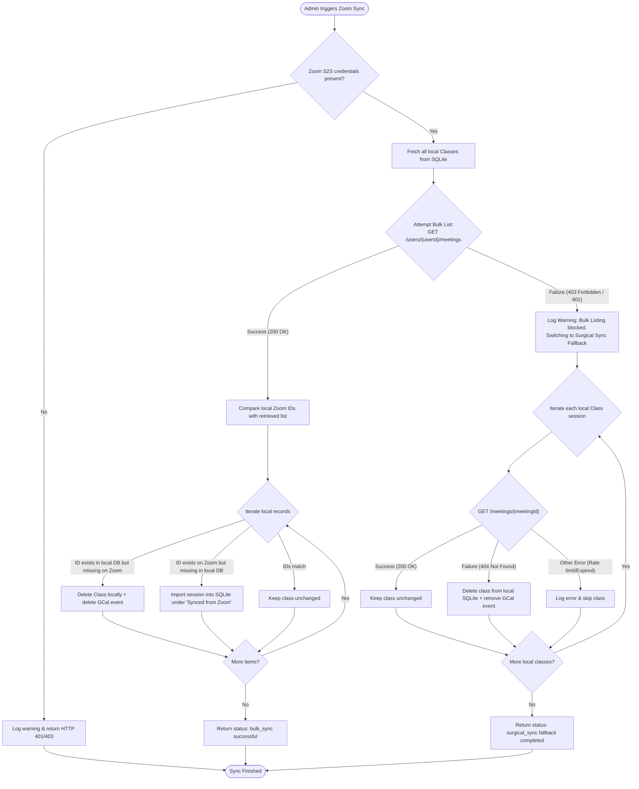

# 🧠 Zoom Class Scheduler — Architecture Flow Diagrams

This document contains detailed visual flow diagrams illustrating the high-level architecture, component interaction, state transition states, event loops, and sync fallbacks of the **Zoom Class Scheduler** project.

---

## 1. High-Level Component & Data Flow

This diagram illustrates how React frontend clients interact with FastAPI backend gateways, local database stores, and third-party APIs (Zoom, Google APIs, SMTP, CRM).

---

## 2. Ticket State Transition Flow

This state machine details how a Scheduled Class Session moves from form creation to full multi-service integration synchronization, updates, and cancellation.

---

## 3. Real-Time Integration Sync Loop (Event Bus)

This sequence diagram shows the precise, timeline execution of events when an Admin schedules a class session. It highlights how the Zoom API acts as the synchronous gateway, while other integrations execute in non-blocking background workers.

---

## 4. Manual Sync & Surgical Fallback Flow

This flowchart illustrates the logic flow triggered when an administrator executes a manual Zoom synchronization. It highlights the automatic shift from bulk list comparisons to individual checks if Zoom permissions restrict standard listing.

